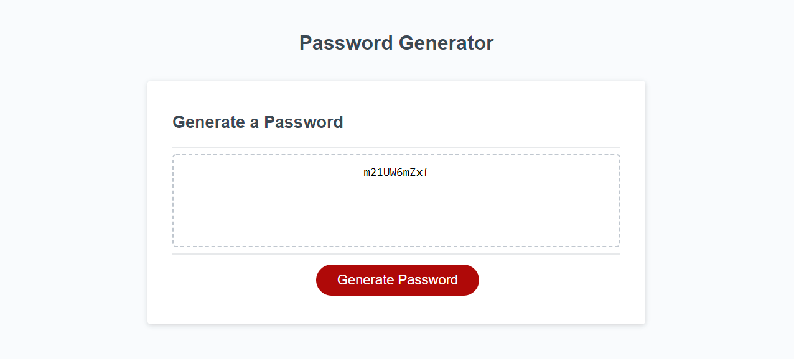

# password-generator

A web application that will generate a random password between 8 and 128 
characters. Password length and character types are set by the user through
popup box inputs. An example of the webpages functionality can be seen below,
and the live webpage can be found [here](https://cameronmseibel.github.io/password-generator).

